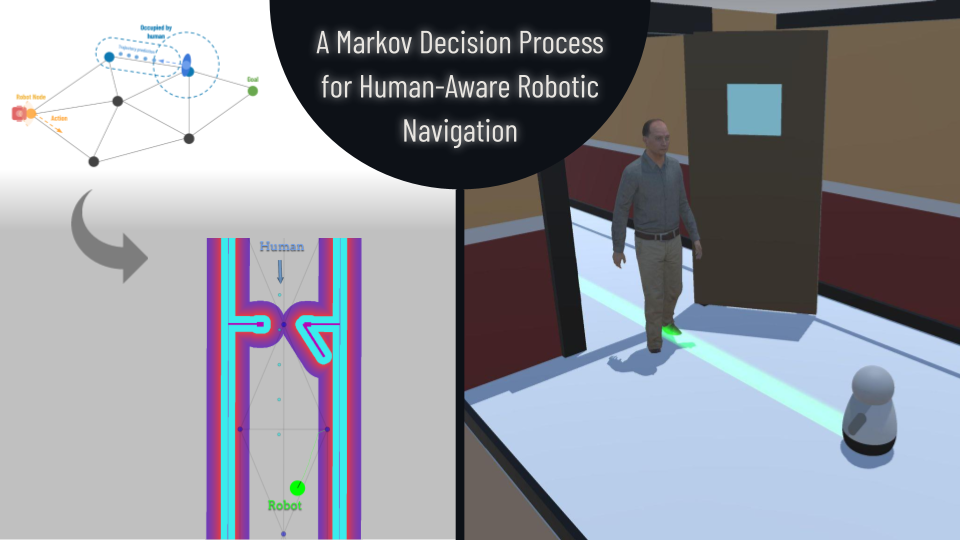

# [IROS 2024] A Markov Decision Process for Human-Aware Robotic Navigation

<p align="center">
    
</p>

*Youtube video : [A Markov Decision Process for Human-Aware Robotic Navigation]()*

The Markov Decision Process Based Social Navigation (MBSN) is a method allowing the robot to navigate in an environment populated by dynamic agents (humans).
This method relies on Markovian Decision Processes (MDP) to define the optimal policy for the robot to follow, a sequence of decisions to take (i.e. actions) which have the greatest probability of gains. For more information, refer to the following paper:

This repository contains MBSN, [Human-Aware Timed Elastic Band (HATEB-2)](https://github.com/sphanit/cohan_planner_multi) method and a simulator to benchmark and compare different human-aware navigation methods.
This benchmark is based on [SEAN](https://sean.interactive-machines.com), which is a simulator running under Unity3d allowing you to compare methods using metrics.
On this new version, we have added the possibility of testing navigation methods under ROS2 by upgrading the simulator to ROS2. We added metrics and offered six everyday life scenarios.
Thanks to the [ROS1_bridge](https://github.com/ros2/ros1_bridge) , a bridge between ROS1 and ROS2, we can compare methods under ROS1 with methods under ROS2, as we did with HATEB (ROS1) and MBSN (ROS2).


## Installation

The experiments were conducted in Ubuntu 20.04 with ROS Noetic, ROS 2 Foxy and Unity 2022.3.10f1.

```console
git clone https://github.com/agouguet/benchmarking_social_robot_navigation.git -b ros2 ~/benchmark_social_navigation
```


```
.                   # ~/benchmark_social_navigation
├── analyse         # Contains all results
│   ├── data        # Raw data
│   └── results     # Data analysis (path images, written metrics)
├── assets
├── ros1_bridge_ws  # ROS1_bridge Workspace
├── ros1_ws         # ROS1 Workspace, contains HATEB
├── ros2_ws         # ROS2 Workspace, contains TCP_Connector ROS2-Unity and MBSN
├── tmux            
│   ├── hateb       # Tmux file to launch HATEB
│   └── MBSN        # Tmux file to launch MBSN
└── unity_sim       # Unity Project

```


### ROS packages

There are three bash scripts available at the root of the project allowing you to build all the necessary ROS packages, open three terminals:

Terminal 1 (ROS1)
```
cd ~/benchmark_social_navigation
source source_ros1.sh
```

Terminal 2 (ROS2)
```
cd ~/benchmark_social_navigation
source source_ros2.sh
```

Terminal 1 (ROS1_bridge)
```
cd ~/benchmark_social_navigation
source source_bridge.sh
```

These scripts will source the ROS packages if they have been built otherwise they will build them.


### Unity project

In Unity Hub, select "Open" and choose ```~/benchmark_social_navigation/unity_sim``` directory. You can now open project in unity. You need to build ROS message in Unity : Robotics -> Generate ROS Messages... -> *Select the msgs directory* (```~/benchmark_social_navigation/ros2_ws/src/msgs/```) and build each messages packages.

## Usage

### In Unity

You have to choose the scenario you want in Unity, in the scenes folder  ```<UnityProject>/Assets/Scenes/Scenario/<Scenario wanted>``` and you can play the scene normally.

### In ROS

We recommend installing ```Tmux``` which is a terminal multiplexer and ```Tmuxinator``` which is a tool that allows you to easily manage tmux sessions using yaml files, we have provided different yaml files for different navigation methods in the folder ```~/benchmark_social_navigation/tmux/<navigation method>```. For example, to use MBSN method :

```
cd ~/benchmark_social_navigation/tmux/MBSN
tmuxinator
```


## Citations

If you use our work, please cite these corresponding works:

```
@article{gouguet2023,
    author = {Adam Gouguet and Abir Karami and Guillaume Lozenguez and Luc Fabresse},
    title = {Benchmarking Off-the-shelf Human-Aware Robot Navigation Solutions},
    journal = {Intelligent Systems Conference (IntelliSys)},
    year = 2023
}
```

```

```

## Questions

If you have any questions, please contact adam.gouguet@imt-nord-europe.fr
